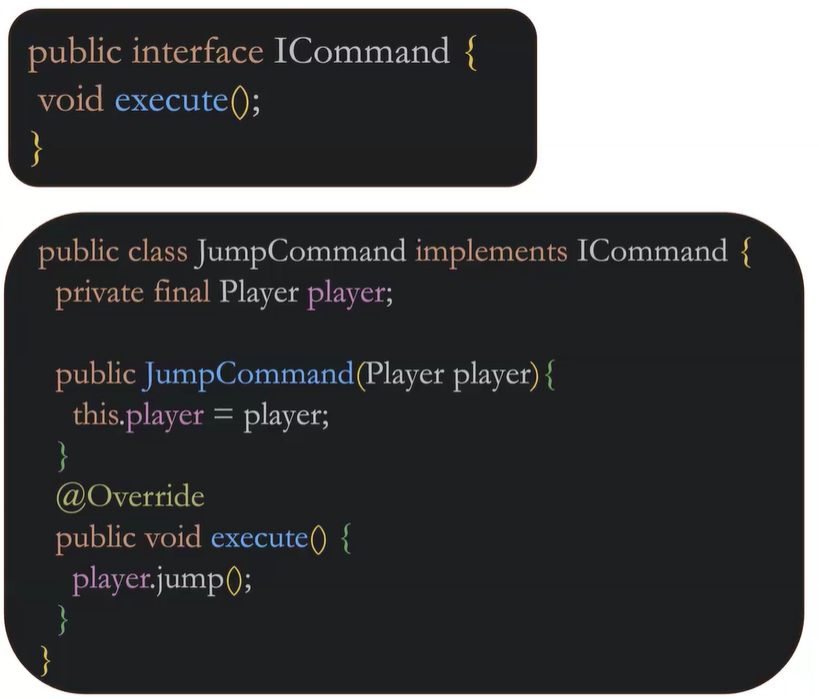
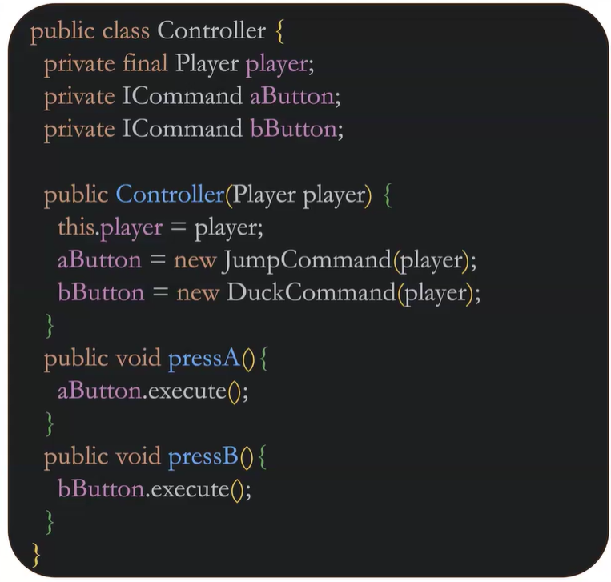

i
# Week 03 - Design Patterns

## Notes

- Reference Book: Design Patterns: Elements of Reusable OO Software
by the 'Gang of Four' - Erich G., Richard H., Ralph J., John V.

- Reference Book: Game Programming Patterns
by Robert Nystrom

- Reference Site: sourcemaking.com

### Defining Design Patterns

- Design patterns are tools, like data structures, that are used depending on the problem. * codified mental model *

- DPs are used to solve a variety of problems inclduing creational, behavioral, and structural. Most of the varieties listed below, rely on inheritance. 

- Creational:
    - Singleton, Factory Method, Builder

- Behavioral:
    - Command, Memento, Observer, State, Strategy

- Structural:
    - Flyweight
    - Decorator

- COMMAND PATTERN:
    - Turns a method into an object that can then be dynamically chagned and shared.

    - Command Patterns allow to store, repeat, and undo methods. They can also be sent over a network which is how remote desktops work - dynamically change controls.

#### Checklist for implementing Command

- Define a Command interface using a method signature.  example: execute(), makeSomething(), calculate(). *Just the method, not those specific named methods.

- Create one or more derived classes that encapsulates some subset of a 'receiver' object, the method to invoke, and the arg to pass.

- Instantiate a Command object for each deferred execution request.

- Pass the Command object from the creator (sender) to the invoker (receiver)

- The invoker decides when to execute()

### Interfaces

- declared similar to a class and used my 'implementing' it.

- CANS and DOS
    - be abstract or static
    - matching interface and file, use .java, and compile to a .class file
    - implemented by a class
    - extends other interfaces

- CAN'TS and DON'TS
    - be instantiated
    - contain constructors
    - fields are public static final * symbolic constants *

#### Abstract Methods
    - no definition
    - declared in either interfaces or abstract classes
    - can have params or return types
    - can't be instantiated
    - may only be extended
    - may have fields, methods, and abstract methods

#### Abstract v. Interface

 ABSTRACT           ||      INTERFACE
 
- shared code 
                        - unrelated classes
- require access
modifiers other         - specify the behavior but not implementation
than public

- need for non-         - take advantage of multiple inheritance of type
static or non-
final fields

 - Why can we only extend one parent? * Diamond Problem * It gets messy and trips Java up - it won't know which version of the method to use.
 - Case in point: a final class can't be extended.

### Summary 
